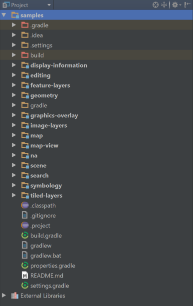
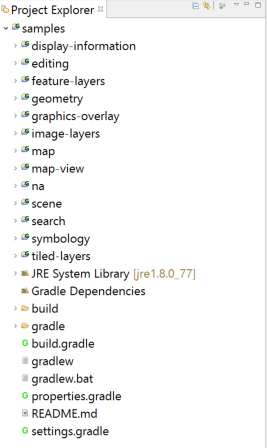

# ArcGIS Runtime Java SDK Samples
### 100.1.0
This project includes a set of samples demonstrating how to accomplish various mapping and GIS tasks with the ArcGIS Runtime SDK for Java.

These samples are built with Gradle. If you want to learn more about Gradle, learn more from [Gradle's guide](https://docs.gradle.org/current/userguide/userguide.html).

This guide has instructions for running samples using the command line or with Eclipse and IntelliJ IDEA.

For developers new to Git, please see the wiki page for how to [clone this repository](https://github.com/Esri/arcgis-runtime-samples-java/wiki/working-with-git).

## Running the Samples
To run the samples in a terminal, `cd` into the project and call the gradle `run` task, supplying the sample main class:

On Linux/Mac
```
$ ./gradlew run -PmainClass="com.esri.samples.scene.display_scene.DisplaySceneSample"
```

On Windows
```
> gradlew.bat run -PmainClass="com.esri.samples.scene.display_scene.DisplaySceneSample"
```

If no `mainClass` property is supplied, the default sample (set in the build.gradle file) will be run. 

There is no need to install Gradle to run the samples.

## The ArcGIS Runtime Gradle Plugin
The plugin provides the project with everything an ArcGIS runtime project needs to run. It adds the 
arcgis api as a dependency and downloads the native libraries into `$USER_HOME/.arcgis`. This download occurs 
automatically the first time you build the project and is only performed once.

## Offline sample data
Some samples require offline data. A `samples-data` directory will automatically download to the project root the 
first time you call the `run` task.

## Importing into an IDE
We will step through how to import the Samples project into Eclipse and IntelliJ IDEA. Other IDEs may support Gradle too. Please consult their documentation for importing Gradle projects.

### IntelliJ IDEA
After cloning the samples, open IntelliJ IDEA and follow these steps:

1. Click *Import Projects* from the Welcome Screen or select *File > New > Project from Existing Sources*.
2. In the select path dialog, select the `build.gradle` file in the `arcgis-runtime-samples-java` directory. Click *OK* after specifying the `build.gradle` file.
3. Click *OK* at the next dialog to complete the import.



To view all of the gradle tasks including the Run task, go to *View > Tool Windows > Gradle*.

Alternatively, you can open the sample's main class, right-click, and select *Run* from the dropdown menu.

### Eclipse
To import the samples with Eclipse's default gradle plugin, follow these steps:

1. Open Eclipse and select *File > Import*.
2. In the import wizard, choose *Gradle > Gradle Project*, then click Next.
3. Select the `arcgis-runtime-samples-java` directory as the project root directory.
4. Click *finish* to complete the import.



## Resources
* [ArcGIS Runtime SDK for Java](https://developers.arcgis.com/java/)  
* [ArcGIS Blog](https://blogs.esri.com/esri/arcgis/)  
* [Esri Twitter](https://twitter.com/esri)  

## Contributing
Esri welcomes contributions from anyone and everyone. Please see our [guidelines for contributing](https://github.com/esri/contributing).

Find a bug or want a new feature? Please let us know by submitting an issue.

## Licensing
Copyright 2016 Esri

Licensed under the Apache License, Version 2.0 (the "License"); you may not 
use this file except in compliance with the License. You may obtain a copy 
of the License at

http://www.apache.org/licenses/LICENSE-2.0

Unless required by applicable law or agreed to in writing, software 
distributed under the License is distributed on an "AS IS" BASIS, WITHOUT 
WARRANTIES OR CONDITIONS OF ANY KIND, either express or implied. See the 
License for the specific language governing permissions and limitations 
under the License.

A copy of the license is available in the repository's license.txt file.
