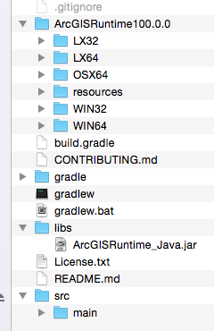
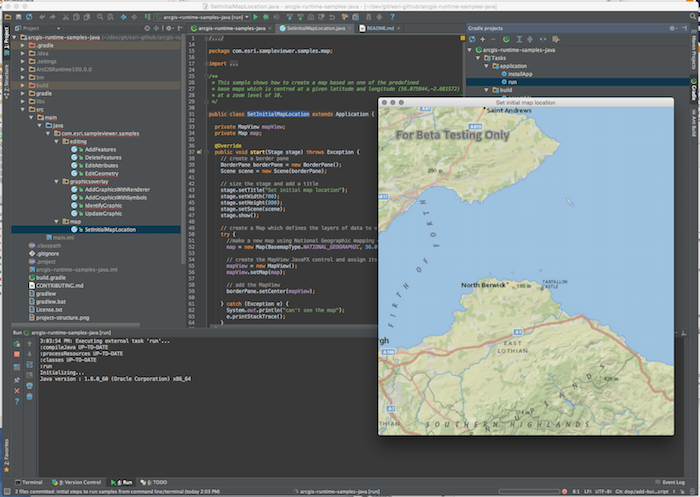
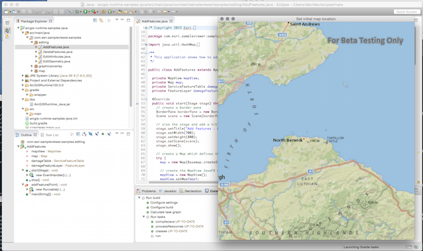

# arcgis-runtime-samples-java

**For Quartz Beta 1**

Here are a set of simple samples that show you how to accomplish different mapping and GIS tasks with the ArcGIS Runtime SDK for Java. The samples use ArcGIS Online basemaps and services.  Learn more [here](http://www.arcgis.com/about/).


## Features
* Basemaps - Set different basemaps
* Feature editing - Edit online feature services
* Graphics overlays - Add temporary data to your map view

# Download
You need to download the ArcGIS Runtime SDK for Java to work with this repository.  For more information please see our [Quartz Beta Developers Site](https://developers.arcgis.com/java/beta). 

# Developer Instructions

##  Fork the repo
If you haven't already, fork the [this repo](https://github.com/Esri/arcgis-runtime-samples-java/fork).

## Clone the repo

### Command line Git
[Clone your fork](https://help.github.com/articles/fork-a-repo#step-2-clone-your-fork)

Open your terminal, navigate to your working directory, use ```git clone``` to get a copy of the repo.

```
# Clones your fork of the repository into the current directory in terminal
$ git clone https://github.com/YOUR-USERNAME/arcgis-runtime-samples-java.git
```

## Configure remote upstream for your fork
To sync changes you make in a fork with this repository, you must configure a remote that points to the upstream repository in Git.

- Open a terminal (Mac users) or command prompt (Windows & Linux users)
- List the current configured remote repository for your fork

```
$ git remote -v
origin	https://github.com/YOUR_USERNAME/arcgis-runtime-samples-java.git (fetch)
origin
```

- Specify a new remote upstream repository

```
$ git remote add upstream https://github.com/Esri/arcgis-runtime-samples-java.git
```

- Verify the new upstream repository

```
$ git remote -v

origin	https://github.com/YOUR_USERNAME/arcgis-runtime-samples-java.git (fetch)
origin	https://github.com/YOUR_USERNAME/arcgis-runtime-samples-java.git (push)
upstream https://github.com/Esri/arcgis-runtime-samples-java.git (fetch)
upstream https://github.com/Esri/arcgis-runtime-samples-java.git (push)
```

## Sync your fork
Once you have set up a remote upstream you can keep your fork up to date with our samples repository by syncing your fork.

- Open a terminal (Mac users) or command prompt (Windows & Linux users)
- Change to the current working directory of your local repository
- Fetch the branches and commits from the upstream repository.  Commits to ```master``` will be stored in a local branch, ```upstream/master```.

```
$ git fetch upstream
```

- Check out your forks local ```master``` branch

```
$ git checkout master
```

- Merge changes from ```upstream/master``` into  your local ```master``` branch which syncs your forks ```master``` branch with our samples repository.

```
$ git merge upstream/master
```

## Run the samples
Once the samples have been forked/cloned locally to your machine you need to add the following from the SDK download.  

- Copy the contents of **JavaSDK100.0.0/ArcGISRuntime100.0.0/** to the root of your samples project.
- Copy the SDK jar file from **JavaSDK100.0.0/sdk/jars/ArcGISRuntime_Java.jar** to the **libs/** folder in the root of your sample project.  You will need to create the **libs/** folder.  

Your project structure should look like the following:  



### Gradle
The samples are designed to run from [gradle](https://gradle.org/).  New to gradle?  Learn more [here](https://gradle.org/getting-started-gradle-java/). There is no need to install anything to run gradle as the samples project comes with the [Gradle Wrapper](https://docs.gradle.org/current/userguide/gradle_wrapper.html).

### Gradle build file
The gradle build file, **build.gradle** is located at the root of the project.  The samples are all listed as source files by package name and class name.  Change the value of the following configuration in your build.gradle file to run any of the samples.  By default the project is set to run the Set Initial Map Locaiton sample as shown below:  

```groovy
mainClassName = 'com.esri.sampleviewer.samples.map.SetInitialMapLocation'
```

If you want to run the Identify Graphic sample change the configuration to the following:  

```groovy
mainClassName = 'com.esri.sampleviewer.samples.graphicsoverlay.IdentifyGraphic'
```

- Open a terminal (Mac users) or command prompt (Windows & Linux users)
- Run the following command

Linux/Mac
```
$ ./gradlew clean run --info
```

Windows
```
> gradlew.bat clean run --info
```

## Import samples into developer IDE
Once you have the project structure in place from above you can import into your favorite IDE or use text editors like Atom or Sublime Text.  

### IntelliJ IDEA
To import the project into IntelliJ IDEA, follow these steps:  

1. If no project is open, click **Import Projects** on the Welcome screen. Otherwise, select **File > New > Project from Existing Sources**.
2. In the select path dialog, select the directory that contains the samples project.
3. On the project model select dialog, select Gradle, and click Next
4. On the next page specify Gradle project settings to use the gradle wrapper and click Finish.  
5. You can see the Gradle tasks by selecting **View > Tool Windows > Gradle**.  Select the Run task to run the sample defined in the build script.



### Eclipse 
Install the [Buildship](https://projects.eclipse.org/projects/tools.buildship) Eclipse Gradle plugin

1. From Eclipse toolbar select **Help > Install New Software...**
2. Click the **Available Software Sites** link in the upper right hand corner of the Intall dialog.
3. Click the **Add** button. 
4. Create a name for the site, e.g **Buildship Gradle plugin** and add the following url to the **Location** http://download.eclipse.org/buildship/updates/e45/releases and click **OK**.

Once you have the plugin installed you can import the sample project into Ecilpse.  

1. From the Eclipse toolbar select **File > Import**.
2. Select **Gradle > Gradle Project** and click Next on the Welcome dialog. 
3. Browse to the directory where you forked/cloned the samples project repository and click **OK** and then **Finish** to exit the wizard.
4. Now should now see the Gradle tasks view, if you don't select **Window > Show View > Other** and select **Gradle > Gradle Tasks**.  You can initiate any task from this window.  Select the **Run** task to run the sample defined in the build script. 



## Resources

* [ArcGIS Runtime SDK for Java](https://developers.arcgis.com/java/)
* [ArcGIS Blog](http://blogs.esri.com/esri/arcgis/)
* [twitter@esri](http://twitter.com/esri)

## Issues

Find a bug or want to request a new feature?  Please let us know by submitting an issue.

## Contributing

Esri welcomes contributions from anyone and everyone. Please see our [guidelines for contributing](https://github.com/esri/contributing).

## Licensing
Copyright 2015 Esri

Licensed under the Apache License, Version 2.0 (the "License");
you may not use this file except in compliance with the License.
You may obtain a copy of the License at

   http://www.apache.org/licenses/LICENSE-2.0

Unless required by applicable law or agreed to in writing, software
distributed under the License is distributed on an "AS IS" BASIS,
WITHOUT WARRANTIES OR CONDITIONS OF ANY KIND, either express or implied.
See the License for the specific language governing permissions and
limitations under the License.

A copy of the license is available in the repository's license.txt  file.

[](Esri Tags: ArcGIS Runtime Java JavaFX)
[](Esri Language: JavaScript)​
