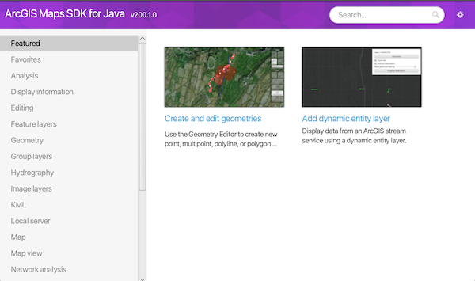

# ArcGIS Maps SDK for Java Samples

[](https://developers.arcgis.com)
[](https://developers.arcgis.com/java/)
[](https://developers.arcgis.com/java/api-reference/reference/index.html)
[](https://developers.arcgis.com/documentation/mapping-apis-and-services/tutorials/)
[](https://github.com/Esri/arcgis-runtime-java-demos)
[](https://github.com/Esri/arcgis-runtime-toolkit-java)

[](https://community.esri.com/t5/arcgis-runtime-sdk-for-java-questions/bd-p/arcgis-runtime-sdk-for-java-questions)

[](https://community.esri.com/t5/arcgis-runtime-sdks-blog/bg-p/arcgis-runtime-sdks-blog)
[](https://www.esri.com/arcgis-blog/developers/)


Welcome to the ArcGIS Maps SDK for Java Samples repository.

The ArcGIS Maps SDK for Java is used to build mapping, location, and GIS applications for desktop applications running on Windows, Mac, or Linux. This repo contains a set of sample projects demonstrating how to accomplish various mapping and geospatial tasks with the ArcGIS Maps SDK for Java.

### Sections
* [Sample Viewer](#sample-viewer)
* [Running the samples locally via this project](#running-the-samples-locally-via-this-project)
* [Setup an API Key](#setup-an-api-key)
* [Offline sample data](#offline-sample-data)
* [System requirements for ArcGIS Maps SDK for Java](#system-requirements-for-arcgis-maps-sdk-for-java)
* [Issues](#issues)
* [Contributing](#contributing)

### Sample viewer
You can browse our samples by downloading our [Sample Viewer Application](https://arcgisruntime.maps.arcgis.com/home/item.html?id=d34b33f673134862bdb414814d9fbd0a).



### Running the samples locally via this project
Each sample is an individual [Gradle](https://docs.gradle.org/current/userguide/userguide.html) project that can be run standalone. Installing Gradle is not necessary since each sample includes the Gradle wrapper.

#### Pre-requisites:

* [System Requirements for ArcGIS Maps SDK for Java](#system-requirements-for-arcgis-maps-sdk-for-java)
* An API Key. [More details](#setup-an-api-key)
* [IntelliJ IDEA](https://www.jetbrains.com/idea/)
* Fork and clone this repo. [More details](WorkingWithGit.md).

#### Manually via the IDE:

1. Open IntelliJ IDEA and select _File > Open..._.
2. Choose one of the sample project directories (e.g. `display-map`) and click _OK_.
3. Select _File > Project Structure..._ and ensure that the Project SDK and language level are set to use Java 17.
4. Store your API key in the `gradle.properties` file located in the `/.gradle` folder within your home directory. The API key will be set as a Java system property when the sample is run.

Note: if a `gradle.properties` file does not already exist in the `/.gradle` folder within your home directory, a Gradle task in the samples `build.gradle` file will generate one for you to populate with your API key.
   ```
   apiKey = yourApiKey
   ```

5. Open the Gradle view with _View > Tool Windows > Gradle_.
6. In the Gradle view, double-click the `run` task under _Tasks > application_ to run the app.

Note: *if you encounter the error `Could not get unknown property 'apiKey' for task ':run' of type org.gradle.api.tasks.JavaExec.` you may have to set the Gradle user home in the IntelliJ Gradle settings to the `/.gradle` folder in your home directory.*

#### Via the terminal:

1. `cd` into one of the sample project directories (e.g. `display-map`).
2. Run `gradle wrapper` to create the Gradle Wrapper
3. Store your API key in the `gradle.properties` file located in the `/.gradle` folder within your home directory. The API key will be set as a Java system property when the sample is run.
4. Run `./gradlew run` on Linux/Mac or `gradlew.bat run` on Windows to run the app.

### Setup an API key
Accessing ArcGIS location services, including basemap styles, routing, and geocoding, requires authentication using either [user authentication](https://developers.arcgis.com/security-and-authentication/user-authentication/) or [API Key authentication](https://developers.arcgis.com/documentation/security-and-authentication/api-key-authentication/):

1. User authentication. Allows a user to sign into the application with an ArcGIS account to access ArcGIS content, services, and resources.
2. API key authentication: A long-lived access token that gives your application access to ArcGIS location services. Go to the [Create an API key](https://links.esri.com/create-an-api-key/) to obtain a new API key access token. Ensure the following privileges are enabled: Basemaps, Geocoding, and Routing.

### Offline sample data
Some samples require offline data. A `samples-data` directory will automatically download to the project root when the Gradle project is configured/imported.

### System requirements for ArcGIS Maps SDK for Java

See the ArcGIS Maps SDK for Java's [system requirements](https://developers.arcgis.com/java/reference/system-requirements/).

### Issues

Find a bug or want to request a new feature?  Please let us know by submitting an issue.

### Contributing

Esri welcomes contributions from anyone and everyone. Please see our [guidelines for contributing](https://github.com/esri/contributing).

New to Git? Check out our [Working with Git](WorkingWithGit.md) guide.

### Licensing

Copyright 2023 Esri

Licensed under the Apache License, Version 2.0 (the "License"); you may not
use this file except in compliance with the License. You may obtain a copy
of the License at

http://www.apache.org/licenses/LICENSE-2.0

Unless required by applicable law or agreed to in writing, software
distributed under the License is distributed on an "AS IS" BASIS, WITHOUT
WARRANTIES OR CONDITIONS OF ANY KIND, either express or implied. See the
License for the specific language governing permissions and limitations
under the License.

A copy of the license is available in the repository's license.txt file.
