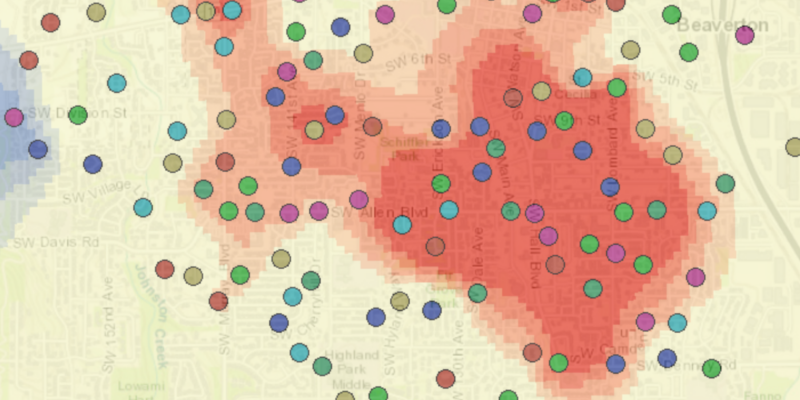

# Analyze Hotspots

Perform hotspot analysis using a geoprocessing service.

In this case, frequency of 911 calls in an area are analyzed.

## How to use the sample

Select a start and end date using the datepickers between 1/1/1998 and 5/31/1998 respectively. Click the "Analyze hotspots" button to start the geoprocessing job.

## How it works

To analyze hotspots using a geoprocessing service:

1. Create a `GeoprocessingTask` with the URL set to the endpoint of the geoprocessing service.
2. Create a query string with the date range as an input of `GeoprocessingParameters`.
3. Use the `GeoprocessingTask` to create a `GeoprocessingJob` with the parameters.
4. Start the job and wait for it to complete and return a `GeoprocessingResult`.
5. Get the resulting `ArcGISMapImageLayer` using `geoprocessingResult.getMapImageLayer()`.
6. Add the layer to the map's operational layers.

## Relevant API

* ArcGISMapImageLayer
* GeoprocessingJob
* GeoprocessingParameters
* GeoprocessingResult
* GeoprocessingString
* GeoprocessingTask
