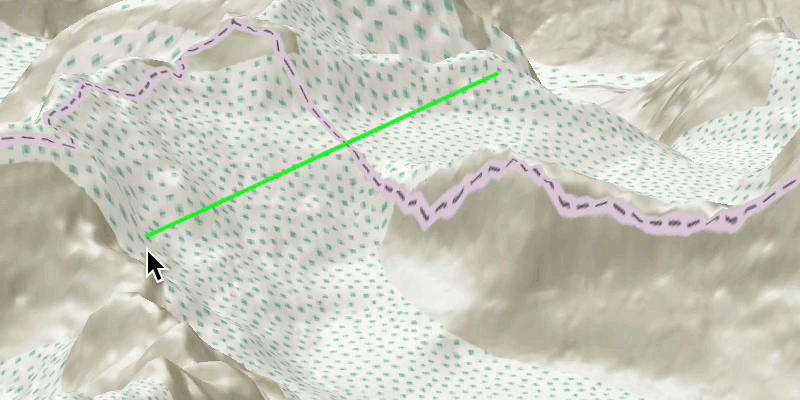

#  Line of Sight Location

Perform line of sight analysis in real-time.

##  How to use the sample

Click to turn on the mouse move event listener. Then move the mouse where you want the target location to be. Click again to lock the target location.

##  How it works

To create a line of sight and update it with the mouse:

1.  Create an `AnalysisOverlay` and add it to the scene view.
2.  Create a `LocationLineOfSight` with initial observer and target locations and add it to the analysis overlay.
3.  Make an `EventHandler<MouseEvent>` to capture mouse movement. Turn the screen point into a scene point with `sceneView.screenToLocationAsync(screenPoint)`.
4.  Update the target location with `lineOfSight.setTargetLocation(scenePoint)`.

##  Relevant API

*   3D
*   AnalysisOverlay
*   ArcGISTiledElevationSource
*   ArcGISScene
*   Camera
*   LocationLineOfSight
*   SceneView