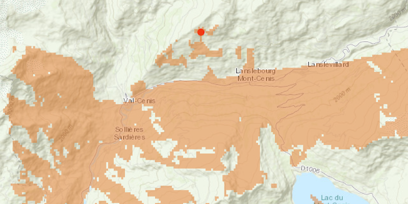

#  Viewshed Geoprocessing

Calculate a viewshed against terrain using a geoprocessing service.

##  How to use the sample

After the geoprocessing task finishes loading (the spinner will stop), click anywhere on the map to generate a viewshed at that location. A viewshed will be calculated using the service's default distance of 15km.

##  How it works

To create a viewshed from a geoprocessing service:

1.  Create a `GeoprocessingTask` with the URL set to the viewshed endpoint of a geoprocessing service .
2.  Create a `FeatureCollectionTable` and add a new `Feature` whose geometry is the `Point` where you want to create the viewshed.
3.  Make `GeoprocessingParameters` with an input for the viewshed operation `parameters.getInputs().put("Input_Observation_Point", new GeoprocessingFeatures(featureCollectionTable))`.
4.  Use the `GeoprocessingTask` to create a `GeoprocessingJob` with the parameters.
5.  Start the job and wait for it to complete and return a `GeoprocessingResult`.
6.  Get the resulting `GeoprocessingFeatures` using `geoprocessingResult.getOutputs().get("Viewshed_Result")`.
7.  Iterate through the viewshed features in `geoprocessingFeatures.getFeatures()` to use their geometry or display the geometry in a graphic.

##  Relevant API

*   FeatureCollectionTable
*   GeoprocessingFeatures
*   GeoprocessingJob
*   GeoprocessingParameters
*   GeoprocessingResult
*   GeoprocessingTask