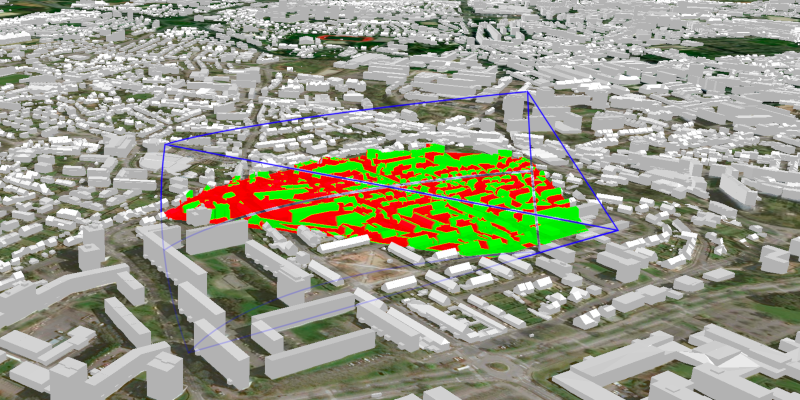

# Viewshed Location

Adjust the position, angles, range, and style of a viewshed.

## How to use the sample

Use the corner UI controls to change the properties of the viewshed and see them updated instantly. To move the viewshed, click on the scene and move your mouse. Click again to stop moving the viewshed.

## How it works

To create a viewshed from a location and directional parameters:

1.  Create a `LocationViewshed` passing in the observer location, heading, pitch, horizontal/vertical angles, and min/max distances.
2.  Set the property values directly on the viewshed instance for location, direction, range, and visibility properties. The colors are global, so change them via the static properties on `Viewshed`.

## Relevant API

*   3D
*   AnalysisOverlay
*   ArcGISTiledElevationSource
*   ArcGISScene
*   ArcGISSceneLayer
*   LocationViewshed
*   SceneView