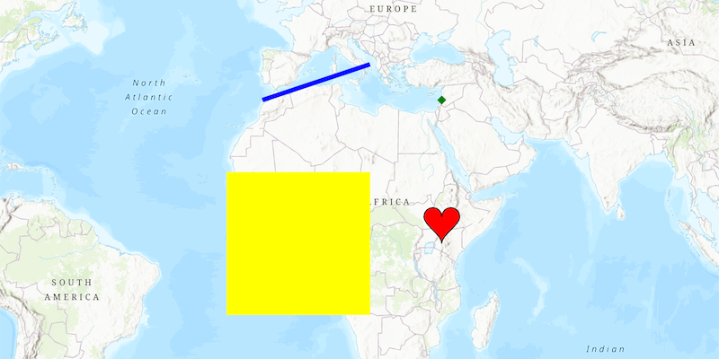

# Add Graphics with Renderer

Specify a graphic's symbol with a renderer.

A renderer allows you to change the style of all graphics in an overlay by only changing one copy of the symbol. A renderer will only effect 
graphics that do not specify their own symbol.

## How it works

To show a `Graphic` in a `GraphicsOverlay` using a renderer:

1.  Create a `GraphicsOverlay` and add it to the `MapView`
2.  Create a `Graphic`, specifying only its geometry
3.  Create a single `Symbol` such as a `SimpleMarkerSymbol`
4.  Create a renderer with the symbol such as `new SimpleRenderer(symbol)`
5.  Set the renderer on the graphics overlay with `graphicsOverlay.setRenderer(renderer)`

## Relevant API

*   ArcGISMap
*   Graphic
*   GraphicsOverlay
*   MapView
*   Point
*   SimpleFillSymbol
*   SimpleLineSymbol
*   SimpleMarkerSymbol
*   SimpleRenderer

