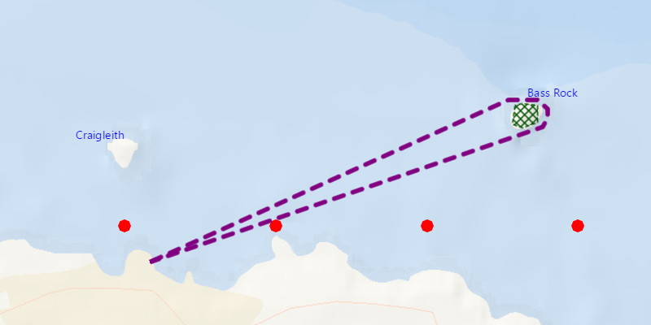

# Add Graphics with Symbols

Draw simple graphics with marker, line, polygon, and text symbols.

## How it works

To display a `Graphic` using a symbol:

  1. Create a `GraphicsOverlay` and add it to the `MapView`, `MapView.getGraphicsOverlay.add()`.
  2. To create a graphic using a `SimpleMarkerSymbol`.
  * create a `Point` where the graphic will be located
  * create a simple marker symbol that will display at that point
  * assign point and symbol to graphic, `Graphic(point, symbol)`
  3. To create a graphic using a `SimpleLineSymbol`.
  * create a `PointCollection` that will hold all the points that make up the line
  * create a `Polyline` using the point collection, `Polyline(PointCollection)`
  * create a simple line symbol that will display over those collected points
  * assign polyline and symbol to graphic, `Graphic(polyline, symbol)`
  4. To create a graphic using a `SimepleFillSymbol`.
  * create a point collection that will hold all the points that make up the line
  * create a `Polygon` using the point collection, `Polygon(PointCollection)`
  * create a simple line symbol that will display as an outline for points collected
  * create a simeple fill symbol, using line symbol from above, that will fill the region in between the points collected with a single color
  * assign polygon and symbol to graphic, `Graphic(polygon, symbol)`
  5. To create a graphic using a `TextSymbol`.
  * create a point where the graphic will be located
  * create a text symbol, that will display at that point
  * assign point and symbol to graphic, `Graphic(point, symbol)`
  6. Add graphic to graphics overlay to display it to the map view.

## Relevant API

  * Graphic
  * GraphicsOverlay
  * MapView
  * Point
  * PointCollection
  * Polygon
  * Polyline
  * SimepleFillSymbol
  * SimpleLineSymbol
  * SimpleMarkerSymbol
  * TextSymbol

