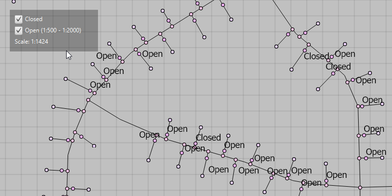

# Control annotation sublayer visibility

Use annotation sublayers to gain finer control of annotation layer subtypes.

## Use case

Annotation, which differs from labels by having a fixed place and size, is typically only relevant at particular scales. Annotation sublayers allow for finer control of annotation by allowing properties (e.g. visibility in the map and legend) to be set and others to be read (e.g. name) on subtypes of an annotation layer.

An annotation dataset which marks valves as "Opened" or "Closed", might be set to display the "Closed" valves over a broader range of scales than the "Opened" valves, if the "Closed" data is considered more relevant by the map's author. Regardless, the user can be given a manual option to set visibility of annotation sublayers on and off, if required.

## How to use the sample

Start the sample and take note of the visibility of the annotation. Zoom in and out to see the annotation turn on and off based on scale ranges set on the data. The scale ranges were set by the map's author using ArcGIS Pro:

* The "Open" annotation sublayer has its maximum scale set to 1:500 and its minimum scale set to 1:2000.
* The "Closed" annotation sublayer has no minimum or maximum scales set, so will be drawn at all scales.

Use the checkboxes to manually set "Open" and "Closed" annotation sublayers visibility to on or off.

## How it works

1. Load the `MobileMapPackage`.
2. Populate checkbox text with the `AnnotationSublayer` names (including maximum and minimum scales, where relevant).
3. Set the annotation sublayer's visibility as required.
 
## Relevant API

* AnnotationLayer
* AnnotationSublayer
* LayerContent

## Tags

scale, text, utilities
