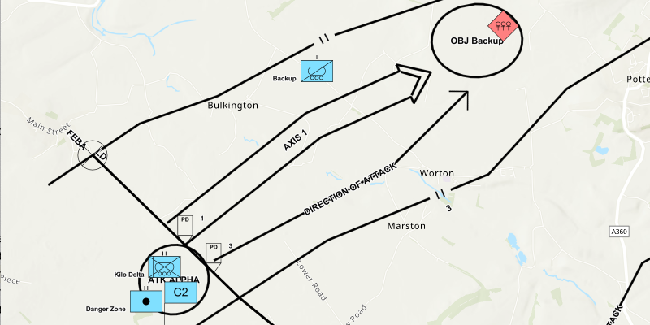

# Dictionary renderer with graphics overlay

Display mil2525d symbols.

## Use case

Use a dictionary renderer on a graphics overlay to display more transient data, such as military messages coming through a local tactical network.

## How to use the sample

Pan and zoom to see military symbols within the map.

## How it works

1. Create a new `DictionarySymbolStyle` from a stylx file.
2. Create a new `DictionaryRenderer` from the dictionary symbol style.
3. Create a new `GraphicsOverlay` and set the  dictionary renderer to the graphics overlay.
4. Parse through the local XML file creating a map of key/value pairs for each block of attributes.
5. Create a `Graphic` for each attribute:
    1. Use the `_wkid` key to get the geometry's spatial reference.
    2. Use the `_control_points` key to get the geometry's shape.
6. Add the graphic to the graphics overlay.

## Relevant API

* DictionaryRenderer
* DictionarySymbolStyle
* GraphicsOverlay

## Tags

dictionary renderer, dictionary symbol style, military, symbol
