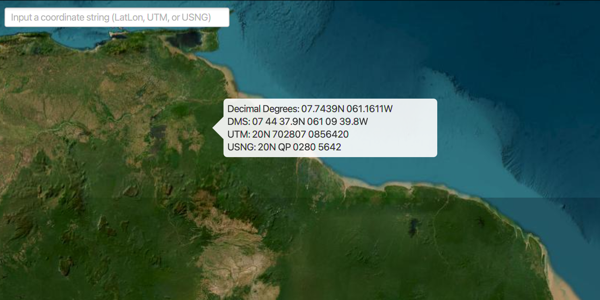

# Format Coordinates

Write coordinates in a variety of common formats.

Convert a map location Point in WGS84 to a String in a number of different 
coordinate notations (and vice versa) including decimal degrees; degrees, minutes, seconds; Universal Transverse 
Mercator (UTM), and United States National Grid (USNG).
 
 

## How to use the sample

Click on the map to see a callout with the clicked location's coordinate formatted in 4 different ways. You can 
also put a coordinate string in any of these formats in the text field. Hit Enter and the coordinate string will be 
converted to a map location which the callout will move to.

## How it works

To convert between a `Point` and different coordinate formats using the 
`CoordinateFormatter`:

  1. Get or create a map `Point` with a spatial reference.
  2. Use one of the static "to" methods on `CoordinateFormatter` such as 
  `CoordinateFormatter.toLatitudeLongitude(point, CoordinateFormatter.LatitudeLongitudeFormat.DECIMAL_DEGREES,
   4)` to get the formatted string`.
  3. To go from a formatted string to a `Point`, use one of the "from" static methods like 
  `CoordinateFormatter.fromUtm(coordinateString, map.getSpatialReference(), CoordinateFormatter.UtmConversionMode
  .LATITUDE_BAND_INDICATORS)`.

## Relevant API

  * ArcGISMap
  * ArcGISTiledLayer
  * Basemap
  * Callout
  * CoordinateFormatter
  * MapView

