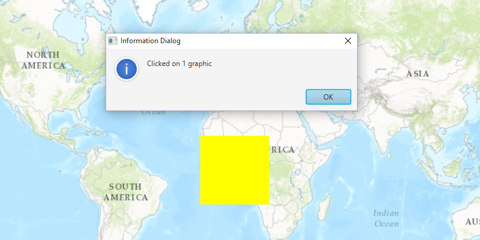

# Identify Graphics

Determine if a graphic was clicked.

## How to use the sample

When you click on a graphic on the map, you should see an alert.

## How it works

To identify a `Graphic` from the `MapView`.

  1. Create a `GraphicsOverlay` and add it to the MapView.
  2. Add Graphic along with a `SimpleFillSymbol`.
  3. Add the graphic to the graphics overlay.
  4. Identify the graphics on the specified location, `MapView.identifyGraphicsOverlayAsync(graphicsOverlay, point, tolerance, max results)` method.

## Relevant API

  * Graphic
  * GraphicsOverlay
  * MapView
  * PointCollection
  * Polygon
  * SimpleFillSymbol

