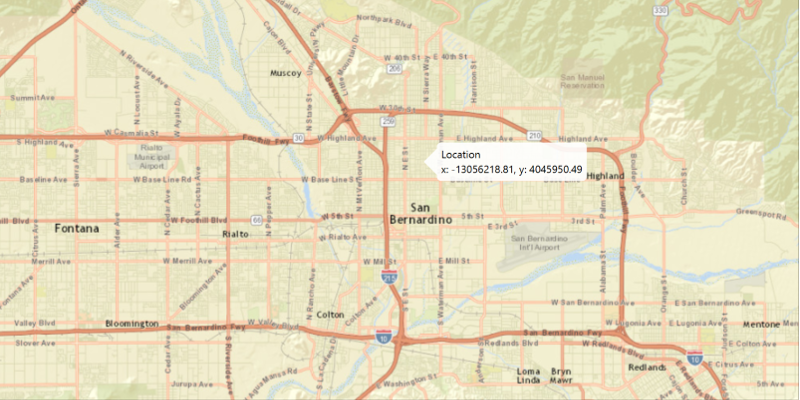

# Show Callout

Show a callout at the clicked location.

## How to use the sample

Click anywhere on the map to show a callout with the clicked location's coordinates.

## How it works

To show a `Callout` with the clicked location's coordinates:

 1.  Use `MapView.setOnMouseClicked()` to create a click event handler.
 2.  Create a new Point2.  object from the events getX() and getY() coordinates.
 3.  Get the `Point`s location on the map, `MapView.screenToLocation(Point2D)`.
 4.  Get the `MapView`'s callout, `MapView.getCallout()`.
 5.  Use `Callout.setDetail()` to display map's point `Point.getX()` and `Point.getY()` to screen.
 6.  Show the callout, `Callout.showCalloutAt(point)`, and dismiss on the next click with `Callout.dismiss()`.

## Relevant API

 *   ArcGISMap
 *   Callout
 *   MapView
 *   Point

