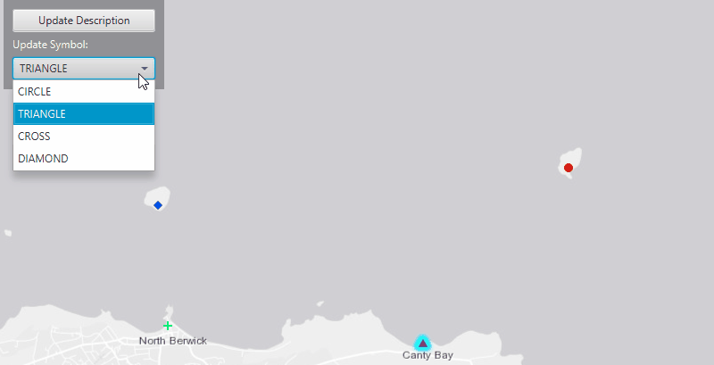

# Update Graphics

Change a graphic's symbol, attributes, and geometry.

A graphic's geometry is its location on a map. The symbol controls how a graphic will be displayed to a map. And the attributes store information about the graphic in key value pairs.

## How to use the sample

Update Graphic's Location:
  - click on a graphic, then click the update location button
  - now click a new location on the map to move graphic

Update Graphic's Description:
  - click on a graphic, then click the update description button
  - enter a new description and click ok

Update Graphic's Symbol:
  - click on a graphic, then choose a symbol from the update symbol drop down box

## How it works

How to change a `Graphic`'s symbol, attributes, and geometry:

1. Create a `GraphicsOverlay` and attach it to the `MapView`.
2. Create graphics using a `Point` and `SimpleMarkerSymbol`.
    * point gives the x,y-coordinate location of where SimpleMarkerSymbol will be located
3. Add two Attributes to each graphic, `Graphic.getAttributes().put()`.
    * first attribute key NAME and value the name for that graphic
    * second attribute key DESCRIPTION and value a description for that graphic
4. Add graphics to the graphics overlay, `GraphicsOverlay.getGraphics().add(graphic)`.
5. Identify graphic that user has selected using `MapView.identifyGraphicsOverlayAsync(GraphicsOverlay,Point2D, tolerance, maximumResults)`.
    * graphics overlay, the one that was created above
    * point2D, from the user mouse click
    * tolerance, places buffer around the point2d
    * maxiumum result, sets the maximum amount of graphics to return near that point2d
6. Select graphic that user selected.
    * the identify will return a list of graphics
    * go through that list and set each graphic's selection to true, `Graphic.setSelected()`
7. To update graphic's location.
    * create a point from the user mouse click, `MapView.screenToLocation()`
    * set that point as the selected graphic's new geometry, `Graphic.setGeometry()`
8. To update graphic's attribute.
    * get attrubutes of selected graphic and set DESCRIPTION key, `Graphic.getAttributes().put("DESCRIPTION",)`
9. To update graphic's symbol.
    * get symbol from the drop down box
    * assign that symbol to the selected graphic, `Graphic.setSymbol()`

## Relevant API

* ArcGISMap
* Graphic
* GraphicsOverlay
* MapView
* SimpleMarkerSymbol
