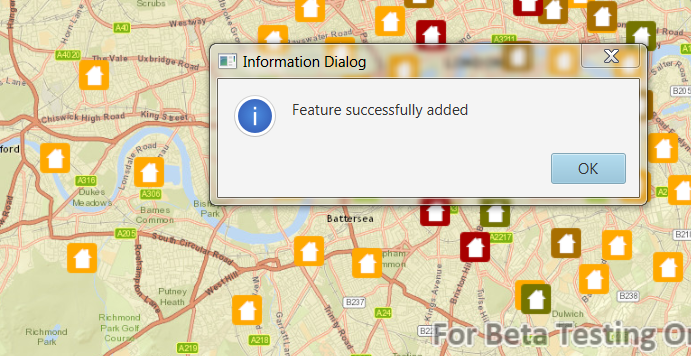

#Add Features#
Demonstrates how to add Features to a FeatureLayer using a feature service. 

##How to use the sample##
Click on a location in the MapView to add a feature at that location.

##How it works##
To get features from a `ServiceFeatureTable` and update it with new features:

1 Create a ServiceFeatureTable from a URL.
2 Create a `FeatureLayer` from the ServiceFeatureTable.
3 Create a `Feature` with attributes and a location using ServiceFeatureTable.
4 Apply the addition to the ServiceFeatureTable by using `ServiceFeatureTable.addFeatureAsync()`.
5 Update the data on the server using `ServiceFeatureTable.applyEditsAsync()`.

##Features##
- ArcGISMap
- Feature
- FeatureLayer
- MapView
- ServiceFeatureTable
