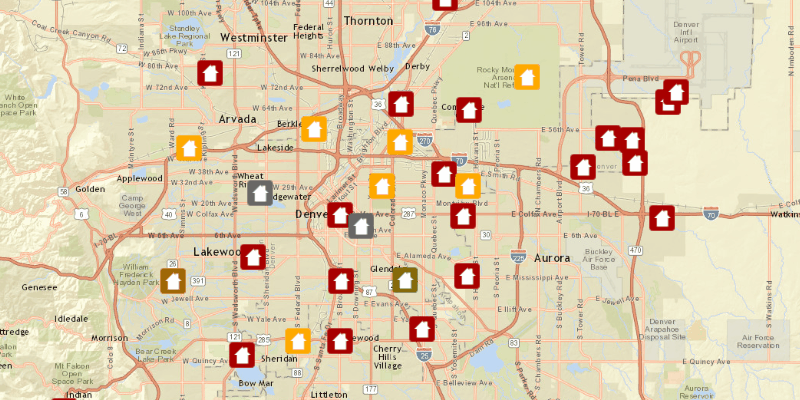

#Add Features
Demonstrates how to add Features to a FeatureLayer using a feature service. 

##How to use the sample
Click on a location in the MapView to add a feature at that location.

##How it works
To get features from a `ServiceFeatureTable` and update it with new `Feature`s:

1. Create a service feature table from a URL.
2. Create a `FeatureLayer` from the service feature table.
3. Create a feature with attributes and a location using service feature table.
4. Apply the addition to the service feature table by using `ServiceFeatureTable.addFeatureAsync()`.
5. Update the data on the server using `ServiceFeatureTable.applyEditsAsync()`.

##Features
- ArcGISMap
- Feature
- FeatureLayer
- MapView
- ServiceFeatureTable
