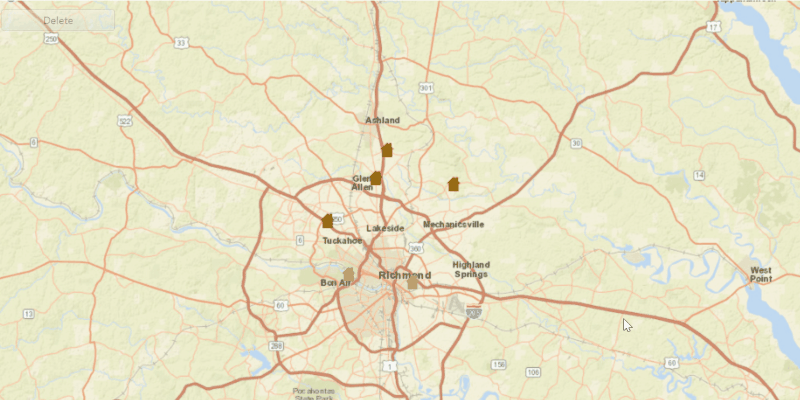

# Delete Features

Delete features from an online feature service.

## How to use the sample

To delete a feature.
  - click on a feature on the Map
  - click on the delete button

## How it works

To delete a `Feature` from a `ServiceFeatureTable`:

1.  Create a service feature table from a URL.
2.  Create a `FeatureLayer` from the service feature table.
3.  Select features from the feature layer via `FeatureLayer.selectFeatures()`.
4.  Remove the selected features from the ServiceFeatureTable using `ServiceFeatureTable.deleteFeaturesAsync()`.
5.  Update the table on the server using `ServiceFeatureTable.applyEditsAsync()`.

## Relevant API

*   ArcGISMap
*   Feature
*   FeatureLayer
*   MapView
*   ServiceFeatureTable

