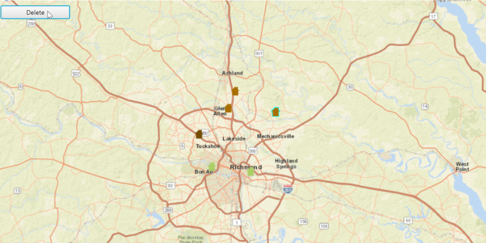

#Delete Features#
This sample demonstrates how to delete a `Feature`s to the `FeatureLayer` using a feature service. 

##How to use the sample##
Click on a feature on the Map. Click on the delete button to delete the feature. An alert should show to confirm the feature is deleted.

##How it works##
To get features from a `ServiceFeatureTable` and remove some of its features:

* Create a ServiceFeatureTable from a URL.
* Create a FeatureLayer from the ServiceFeatureTable.
* Select features from the FeatureLayer via `FeatureLayer.selectFeatures()`.
* Remove the selected features from the ServiceFeatureTable using 
`ServiceFeatureTable.deleteFeaturesAsync()`.
* Update the table on the server using
`ServiceFeatureTable.applyEditsAsync()`.

##Features##
- ArcGISMap
- MapView
- Feature
- FeatureLayer
- ServiceFeatureTable