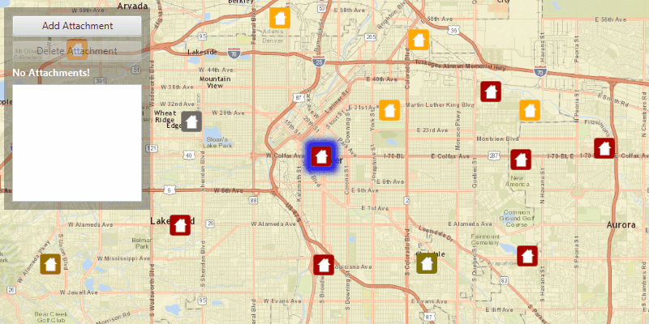

# Edit feature attachments

Add, delete, and download attachments for features from a service.

## Use case

Attachments provide a flexible way to manage additional information that is related to your features. Attachments allow you to add files to individual features, including: PDFs, text documents, or any other type of file. For example, if you have a feature representing a building, you could use attachments to add multiple photographs of the building taken from several angles, along with PDF files containing the building's deed and tax information.

## How to use the sample

Click a feature on the map to select it. Click 'Add attachment' to add an attachment to the selected feature. The list view will update to show the attachments of the selected feature (if any). To delete an attachment, first select the feature, and then select an attachment from the list view. Then click 'Delete Attachment' to delete the selected attachment.

## How it works

1. Create a `ServiceFeatureTable` from a URL.
2. Create a `FeatureLayer` object from the service feature table.
3. Select features from the feature layer with `selectFeatures`.
4. To fetch the feature's attachments, cast to an `ArcGISFeature` and use`ArcGISFeature.fetchAttachmentsAsync()`.
5. To add an attachment to the selected ArcGISFeature, create an attachment and use `ArcGISFeature.addAttachmentAsync()`.
6. To delete an attachment from the selected ArcGISFeature, use the `ArcGISFeature.deleteAttachmentAsync()`.
7. After a change, apply the changes to the server using `ServiceFeatureTable.applyEditsAsync()`.

## Additional information

Attachments can only be added to and accessed on service feature tables when their hasAttachments property is true.

## Relevant API

* ApplyEditsAsync
* DeleteAttachmentAsync
* FeatureLayer
* FetchAttachmentsAsync
* FetchDataAsync
* ServiceFeatureTable
* UpdateFeatureAsync

## Tags

Edit and Manage Data, image, picture, JPEG, PNG, PDF, TXT
