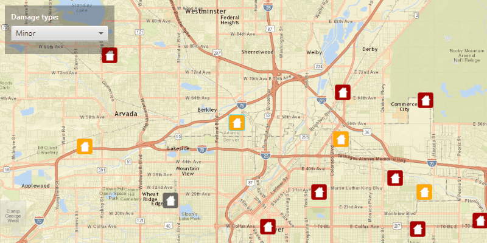

# Update Attributes

Update feature attributes in an online feature service.

## How to use the sample

To change the feature's damage property.
  - select feature from the map
  - from drop down box select a damage type

## How it works

To get a `Feature` from a `ServiceFeatureTable` and update its attributes:

  1. Create a service feature table from a URL.
  2. Create a `FeatureLayer` from the service feature table.
  3. Select features from the feature layer, `FeatureLayer.selectFeatures`.
  4. To update the feature's attribute use the `ArcGISFeature.getAttributes().put()`.
  5. After a change, apply the changes on the server using `ServiceFeatureTable.applyEditsAsync()`.

## Relevant API

  * ArcGISMap
  * Feature
  * FeatureLayer
  * MapView
  * ServiceFeatureTable

