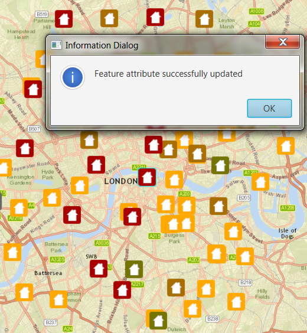

#Update Attributes#
This sample demonstrates how update the attributes of a `Feature` from a `ServiceFeatureTable`.

##How to use the sample##
Features in the map represent properties and its colour the type of damage on that property. In order to change the type of damage, select a feature and click on the Damage Type drop-down. Doing so, would display a list of values to choose from. Selecting one would dismiss the list and update the damage type for the selected property. 

##How it works##
To get features from a `ServiceFeatureTable` and edit its attributes:

- Create a ServiceFeatureTable from a URL.
- Create a FeatureLayer from the ServiceFeatureTable.
- Select features from the FeatureLayer via `FeatureLayer#selectFeatures` method.
- To update the feature's attribute use the `ArcGISFeature#getAttributes().put()` method.
- After a change, apply the changes on the server using `ServiceFeatureTable#applyEditsAsync` method.

##Features##
- ArcGISMap
- MapView
- Feature
- FeatureLayer
- ServiceFeatureTable