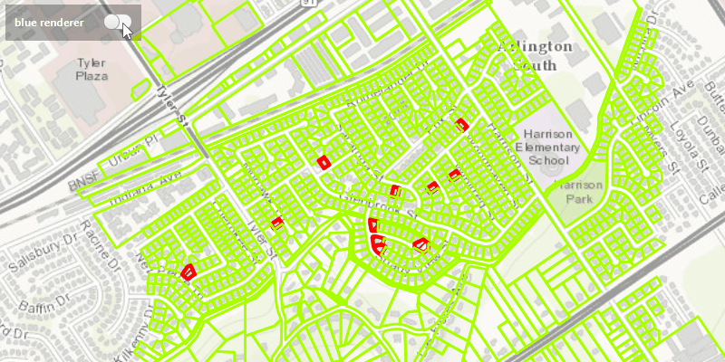

#Change Feature Layer Renderer#
Demonstrates how to change the Renderer of a FeatureLayer.

##How to use the sample##
Use the buttons in the control panel to change the renderer.

##How it works##
To change the `FeatureLayer`'s `Renderer`:

- Create a `ServiceFeatureTable` from a URL.
- Create a feature layer from the service feature table.
- Create a new renderer (in this case, a `SimpleRenderer`).
- Change the feature layer's renderer using `FeatureLayer.setRenderer(SimpleRenderer)`.

##Features##
- ArcGISMap
- FeatureLayer
- MapView
- Renderer
- ServiceFeatureTable
- SimpleRenderer
