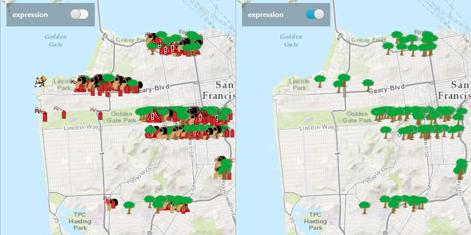

#Feature Layer Definition Expression#
This sample demonstrates how you can limit which `Feature`s to display on the `ArcGISMap`.

##How to use the sample##
Use the buttons in the control panel to apply or reset definition expression.

##How it works##
To limit the Features in your FeatureLayer

- Create a ServiceFeatureTable from a URL.
- Create a FeatureLayer from the ServiceFeatureTable.
- Set the limit of the Features on your feature layer using `featureLayer.setDefinitionExpression(Expression)`.

##Features##
- ArcGISMap
- MapView
- FeatureLayer
- ServiceFeatureTable
