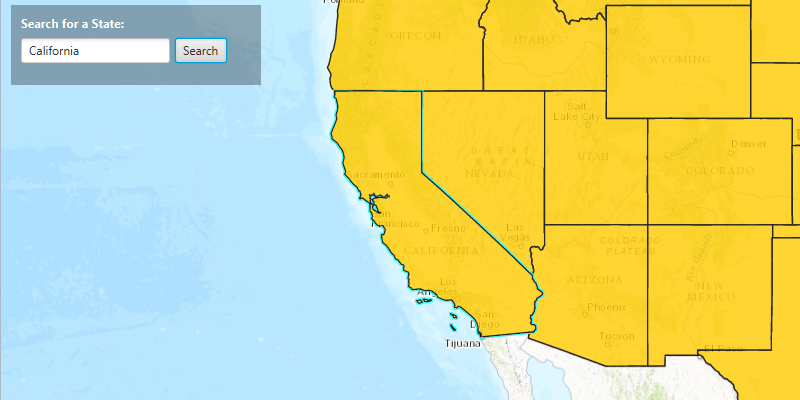

#Feature Layer Query#
This sample shows how to query a `FeatureLayer` via `FeatureTable`.

##How to use the sample##
The sample provides a search bar on the top, where you can input the name of a US State. When you hit search the application performs a query on the feature table and based on the result either highlights the state geometry or provides an error.

Note: The search is case sensitive.

##How it works##
To query the Features in your FeatureLayer

- Create a ServiceFeatureTable from a URL.
- Create a FeatureLayer from the ServiceFeatureTable.
- Create a `QueryParameters` object and specified the where clause on it via `query#setWhereClause()` from the text entered by the user. 
- Fire the query on the FeatureTable using `featureTable#queryFeaturesAsync(query)` method.
- Once it gets complete get the Feature's from the `FeatureQueryResult`.

##Features##
- ArcGISMap
- MapView
- FeatureLayer
- ServiceFeatureTable
- QueryParameters
- FeatureQueryResult