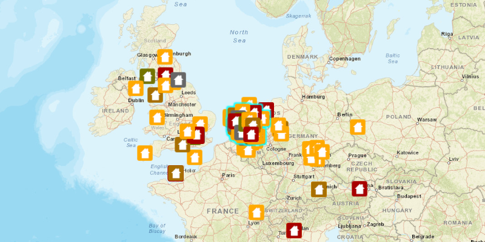

#Feature Layer Selection#
Demonstrates shows how to select Features from a FeatureLayer.

##How to use the sample##
click on a feature from the map to select it.

##How it works##
To select `Feature`s from your `FeatureLayer`

1. Create a `ServiceFeatureTable` from a URL.
2. Create a feature layer from the service feature table.
3. Identify `MapView` on the location the user has clicked.
  - call `MapView.identifyLayerAsync(FeatureLayer, Point2D, tolerance, max results)`
  - feature layer, from above
  - Point2D, location where the user clicked
  - tolerance, area around Point2D to locate features
  - max results, maximum number of features to return
4. Select all features that were identified, `FeatureLayer.selectFeatures()`.

##Features##
- ArcGISMap
- Feature
- FeatureLayer
- MapView
- ServiceFeatureTable
