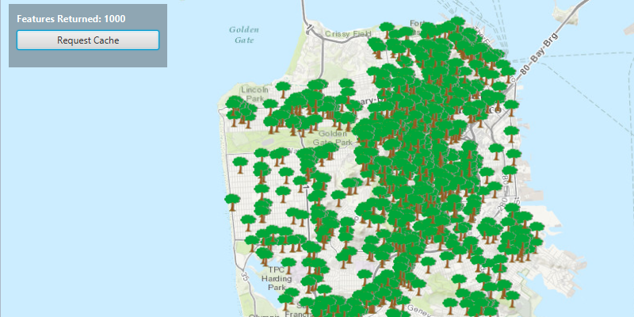

#Service Feature Table (Manual Cache)#
This sample shows how to use a Feature Service in manual cache mode.

##How to use the sample##
Click on the Request Cache button to get the `Feature`s in manual cache mode. The Features Returned label shows how many features are returned by the service.

Note: Maximum of Features returned is set to 1000.

##How it works##
By setting the `FeatureRequestMode` to MANUAL_CACHE on the `FeatureTable`.

##Features##
- ArcGISMap
- MapView
- FeatureLayer
- ServiceFeatureTable
- ServiceFeatureTable.FeatureRequestMode