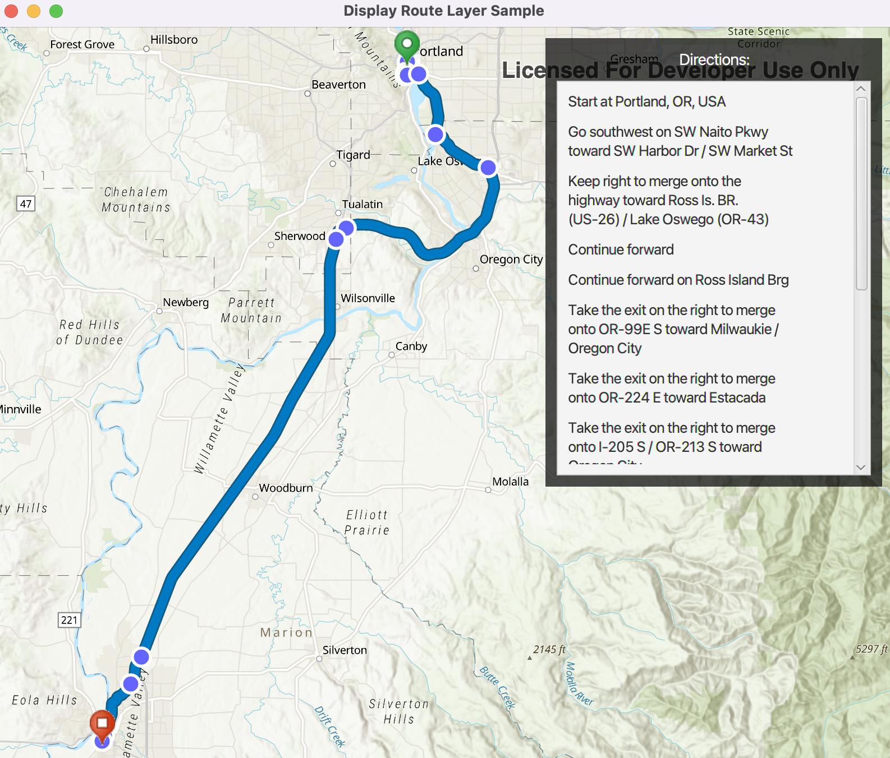

# Display route layer

Display a route layer and its directions using feature collection.

## Use case

Routes can be stored as feature collection layers. These layers can store useful information such as directions, estimated trip time, and more.

You can create a route layer in ArcGIS Pro and store a route layer as a portal item, making it easy to access, share, or display.

## How to use the sample

Pan and zoom to view the route displayed by the feature collection layer. The list of directions are displayed in the UI.

## How it works

1. Create an `PortalItem` with the item ID.
2. Create and load an `FeatureCollection` with the item.
3. After loading, get the specified 'FeatureCollectionTable' by name.
4. Create an array of `Features`.
5. Get the direction text from the attributes of each feature.
6. Create a `FeatureCollectionLayer` with the feature collection and set it to the map's operationalLayers.

## Relevant API

* FeatureCollection
* FeatureCollectionLayer
* FeatureCollectionTable

## Tags

directions, feature collection, route layer
