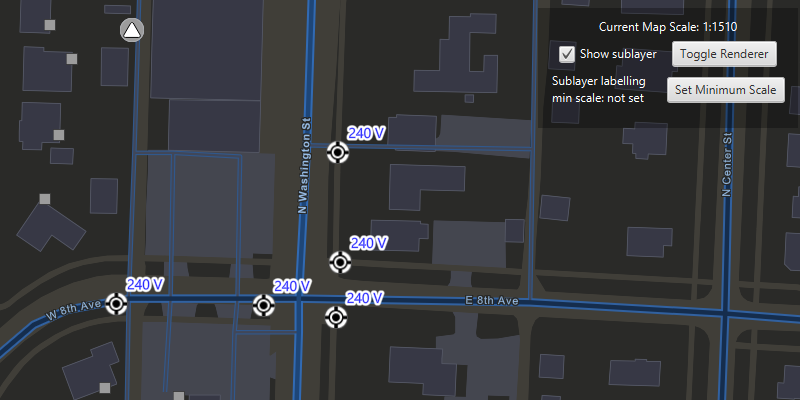

# Display a subtype feature layer

Displays a composite layer of all the subtype values in a feature class.

## Use case

This is useful for controlling labeling, visibility and symbology of a given subtype as though they are distinct layers on the map.

## How to use the sample

The sample loads with the sublayer visible on the map. Toggle its visibility by clicking the "Show sublayer" checkbox. To change the sublayer's renderer, click the "Toggle Renderer" button, and click the "Set Minimum Scale" button to set its minimum scale to that of the current map scale. Zoom in and out to see the sublayer become visible based on its new scale range.

## How it works
1.  Create a `SubtypeFeatureLayer` from a `ServiceFeatureTable` that defines a subtype, and add it to the `ArcGISMap`.
2. Get a `SubtypeSublayer` from the subtype feature layer using its name.
3. Enable the sublayer's labels and define them with `getLabelDefinitions()`.
4. Set the visibility status using this sublayer's `setVisible()` property.
5. Change the sublayer's symbology with `setRenderer(Renderer)`.
6. Update the sublayer's minimum scale value with `setMinScale()`.

## Relevant API

* LabelDefinition
* ServiceFeatureTable
* SubtypeFeatureLayer
* SubtypeSublayer

## About the data

The [feature service layer](https://sampleserver7.arcgisonline.com/arcgis/rest/services/UtilityNetwork/NapervilleElectric/FeatureServer/100) in this sample represents an electric network in Naperville, Illinois, which contains a utility network with asset classification for different devices.

## Tags

asset group, feature layer, labeling, sublayer, subtype, symbology, utility network, visible scale range
