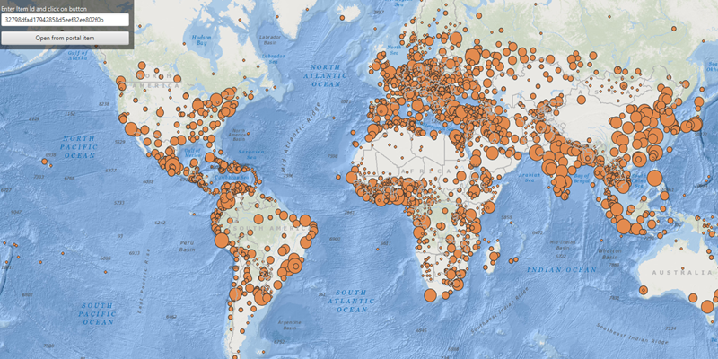

# Feature Collection Layer From Portal

Create a feature collection layer from a portal item.

## Use case

Feature collection layers are often used to hold features with mixed geometry or unstructured data. You can display feature collections stored in a Portal, which are often used for showing content from a CSV or map notes.

## How to use the sample

The feature collection is loaded from the Portal item when the sample starts. Enter the ID of a Portal item that holds a feature collection into the text field, and click on the button to see result.

## How it works

1. Create a `Portal`.
2. Create the `PortalItem`, referring to the portal and an item ID.
3. Verify that the item represents a feature collection.
4. Create a `FeatureCollection` from the item.
5. Create a `FeatureCollectionLayer`, referring to the feature collection.
6. Add the feature collection layer to the map's `OperationalLayers` collection.

## Relevant API

* FeatureCollection
* FeatureCollectionLayer
* Feature
* Portal
* PortalItem
