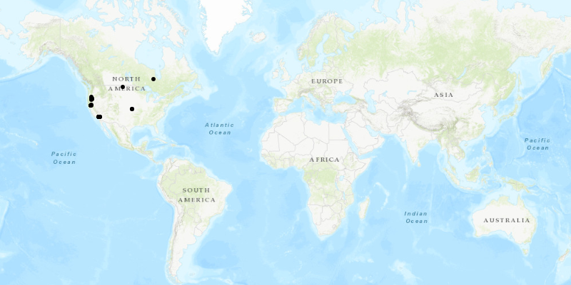

# Feature Collection Layer Query

Create a feature collection layer which shows the result of a SQL query from a service feature table.

## How it works

1.  Create a `ServiceFeatureTable` object from a URL, and store it as a `FeatureTable` object.
	2.  Create a `QueryParameters` object and specify the where clause with `QueryParameters.setWhereClause()`.
	3.  Query the features stored in the feature table with `FeatureTable.queryFeaturesAsync(query)`.
	4.  Once complete, instantiate a `FeatureCollectionTable` with the results of the query from the `FeatureQueryResult` object.
	5.  Create a `FeatureCollection` object, and add the feature collection table to it.
	6.  Create a `FeatureCollectionLayer` object from the feature collection.
	7.  Display the layer by adding it to the map's operational layers with `mapView.getMap().getOperationalLayers().add(featureCollectionLayer)`.

## Relevant API

	*   FeatureCollection
	*   FeatureCollectionLayer
	*   FeatureCollectionTable
*   FeatureLayer
	*   FeatureTable
*   FeatureQueryResult
*   QueryParameters
*   ServiceFeatureTable

## Tags
FeatureQueryResult, FeatureCollection, FeatureCollectionLayer, FeatureCollectionTable, query
