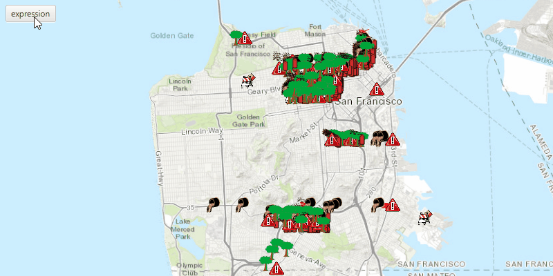

# Feature Layer Definition Expression

Filter which features are shown using an expression.

## How to use the sample

Use the buttons in the control panel to apply or reset definition expression.

## How it works

To limit the `Feature`s in your `FeatureLayer`:

  1. Create a `ServiceFeatureTable` from a URL.
  2. Create a feature layer from the service feature table.
  3. Set the limit of the features on your feature layer using `FeatureLayer.setDefinitionExpression(Expression)`.

## Relevant API

*   ArcGISMap
*   FeatureLayer
*   MapView
*   ServiceFeatureTable

