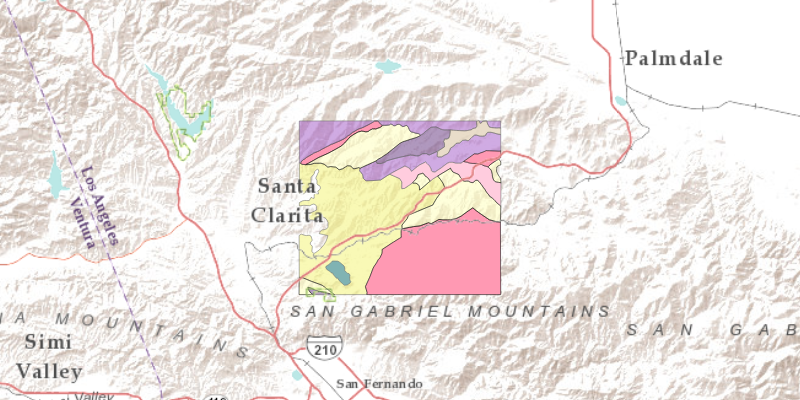

# Feature layer (feature service)

Show features from an online feature service.

<<<<<<< HEAD

=======

>>>>>>> master

## Use case

Feature services are useful for sharing vector GIS data with clients so that individual features can be queried, displayed, and edited.

## How to use the sample

Run the sample and view the feature service as an operational layer on top of the basemap. Zoom and pan around the map to see the features in greater detail.

## How it works

1. Create a `ServiceFeatureTable` from a URL.
2. Create a feature layer from the service feature table.
3. Add the feature layer to your ArcGISMap using `ArcGISMap.getOperationalLayers().add(FeatureLayer)`.

## Relevant API

* ArcGISMap
* Basemap
* FeatureLayer
* MapView
* ServiceFeatureTable

## Tags

feature table, layer, layers, service
