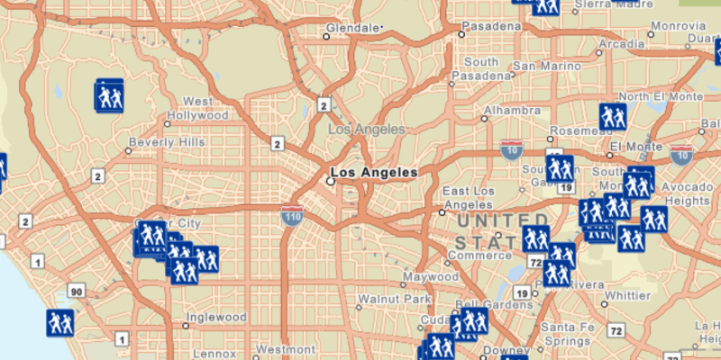

# Feature Layer (Geodatabase)

Display features from a local geodatabase.

## How it works

To create a `Geodatabase` and display it as a `FeatureLayer`:

1.  Create a geodatabase using the provided local resource, `new Geodatabase(geodatabaseResourceUrl)`.
2.  Wait for geodatabase to load, `Geodatabase.addDoneLoadingListener(runnable)`
3.  Get the `Trailheads` `GeodatabaseFeatureTable` from the geodatabase, `Geodatabase.getGeodatabaseFeatureTable(tableName)`
4.  Create feature layer using the table from above, `new FeatureLayer(geodatabaseFeatureTable)`
5.  Add feature layer to `ArcGISMap`, `ArcGISMap.getOperationalLayers().add(featureLayer)`

## Relevant API

*   Basemap
*   FeatureLayer
*   Geodatabase
*   GeodatabaseFeatureTable
*   Map
*   MapView
