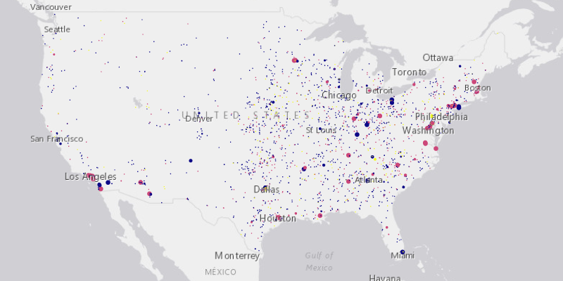

# Service Feature Table (Cache)

Cache features on the client when the user interacts.

On-interaction-cache mode will fetch features within the current extent when needed (performing a pan or zoom) from 
the server and caches those features within a table on the client's side. Any queries performed on features within 
that table will be performed locally, otherwise they will be requested from the server.

## How it works

How to set `FeatureRequestMode.ON_INTERACTION_CACHE` mode:

  1. Create a `ServiceFeatureTable` from a URL.
  2. Set request mode of table, `ServiceFeatureTable.setFeatureRequestMode(FeatureRequestMode.ON_INTERACTION_CACHE)`.

## Relevant API

  * ArcGISMap
  * FeatureLayer
  * MapView
  * ServiceFeatureTable
  * ServiceFeatureTable.FeatureRequestMode

