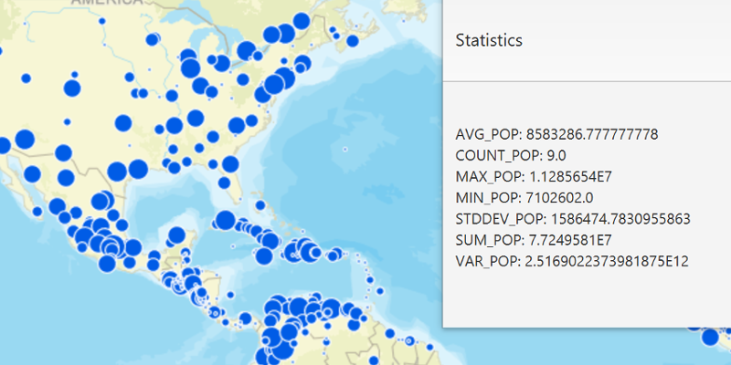

# Statistical Query

Get aggregated feature statistics for a specified field.

## How to use the sample

Check the boxes for the filters you want to use in the query (a spatial filter and an attribute filter). Click 
the "Get Statistics" button to execute the query. A dialog will open with the statistics result.

## How it works

To query statistics on a `FeatureTable` field:

  1. Create a `ServiceFeatureTable` from a URL.
  2. Create a list of `StatisticDefinition`s specifying which field to query against, the aggregate 
  type, and an optional alias.
  3. Create `StatisticsQueryParameters` passing in the definitions. You can also use the setters to 
  specify an area for the query (geometry) or a custom where clause.
  4. Call `featureTable.queryStatisticsAsync(queryParameters)` to make the query.
  5. Get the `StatisticsQueryResult` from the `ListenableFuture`. To see the stastics, 
  iterate through `statisticsQueryResult.iterator()` to get the `StatisticRecord`s.
  6. The map of statistics can be retreived with `record.getStatistics()` for printing or showing in 
  a list view.

## Relevant API

  * ArcGISMap
  * FeatureLayer
  * QueryParameters
  * ServiceFeatureTable
  * StatisticDefinition
  * StatisticRecord
  * StatisticType
  * StatisticsQueryParameters
  * StatisticsQueryResult

