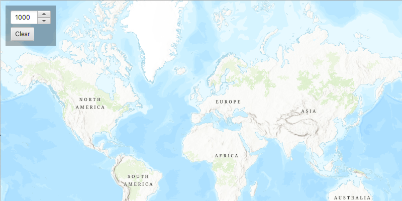

# Buffer

Create a buffer around a map point and display the results as a `Graphic`

## Use case

Creating buffers is a core concept in GIS proximity analysis that allows you to visualize and locate geographic features contained within a polygon. For example, suppose you wanted to visualize areas of your city where alcohol sales are prohibited because they are within 500 meters of a school. The first step in this proximity analysis would be to generate 500 meter buffer polygons around all schools in the city. Any such businesses you find inside one of the resulting polygons are violating the law.

## How to use the sample

Click on the map. A planar and a geodesic buffer will be created at the click location using the distance (miles) specified in the text box. Continue clicking to create additional buffers. Notice that buffers closer to the equator appear similar in size. As you move north or south from the equator, however, the geodesic polygons become much larger. Geodesic polygons are in fact a better representation of the true shape and size of the buffer.

## How it works

1. Capture `Point`s when the `MapView` is clicked.
2. Use The static method `GeometryEngine.buffer()` to create a planar buffer polygon from the map location and distance.
3. Alternatively, use `GeometryEngine.bufferGeodetic()` to create a geodesic buffer polygon using the same inputs.

## Relevant API

* GeometryEngine
* GraphicsOverlay

## Additional information

Buffers can be generated as either `planar` (flat - coordinate space of the map's spatial reference) or `geodesic` (technique that considers the curved shape of the Earth's surface, which is generally a more accurate representation). In general, distortion in the map increases as you move away from the standard parallels of the spatial reference's projection. This map is in Web Mercator so areas near the equator are the most accurate. As you move the buffer location north or south from that line, you'll see a greater difference in the polygon size and shape. Planar operations are generally faster, but performance improvement may only be noticeable for large operations (buffering a great number or complex geometry).

For more information about using buffer analysis, see the topic [How Buffer (Analysis) works](https://pro.arcgis.com/en/pro-app/tool-reference/analysis/how-buffer-analysis-works.htm) in the *ArcGIS Pro* documentation.  

## Tags

analysis, buffer, euclidean, geodesic, geometry, planar
