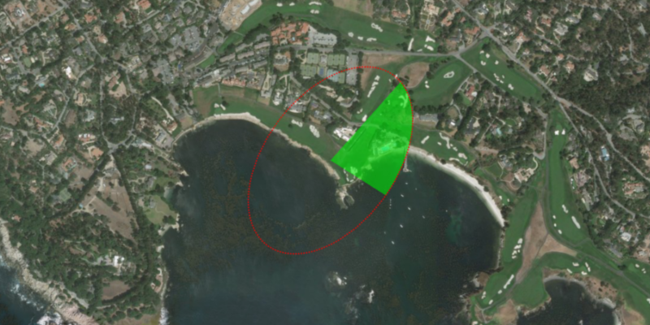

# Geodesic Sector and Ellipse

Create geodesic sectors and ellipses.

Geodesic sectors and ellipses can be used in a wide range of analyses ranging from antenna coverage to projectile landing zones.

## How to use the sample

The geodesic sector and ellipse will display with default parameters at the start. Click anywhere on the map to change the center of the geometries. Adjust any of the controls to see how they affect the sector and ellipse on the fly.

## How it works

To create a geodesic sector and ellipse:

1. Create `GeodesicSectorParameters` and `GeodesicEllipseParameters` using one of the constructors with default values or using each setter individually.

2. Set the `center`, `axisDirection`, `semiAxis1Length`, and the `semiAxis2Length` properties to change the general ellipse position, shape, and orientation.

3. Set the `sectorAngle` and `startDirection` angles to change the sector's shape and orientation.

4. Set the `maxPointCount` and `maxSegmentLength` properties to control the complexity of the geometries and the approximation of the ellipse curve.

5. Specify the `geometryType` to either `POLYGON`, `POLYLINE`, or `MULTIPOINT` to change the result geometry type.

6. Pass the parameters to the related static methods: `GeometryEngine.ellipseGeodesic(geodesicEllipseParameters)` and `GeometryEngine.sectorGeodesic(geodesicSectorParameters)`. The returned value will be a `Geometry` of the type specified by the `geometryType` parameter.

## Relevant API

*   GeodesicEllipseParameters
  
*   GeodesicSectorParameters

*   GeometryEngine

*   GeometryType

## Additional information

To create a circle instead of an ellipse, simply set `semiAxis2Length` to 0.0 and `semiAxis1Length` to the desired radius of the circle. This eliminates the need to update both parameters to the same value.
