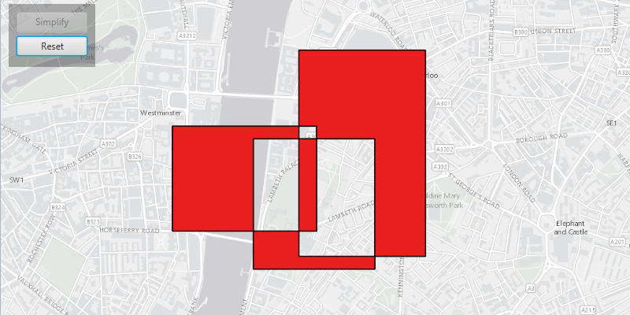

# Geometry engine simplify

Simplify a polygon with a self-intersecting geometry.

## Use case

A user may draw a polygon which is self-intersecting or contains incorrect ring orientations. The geometry must be simplified before it can be saved to a geodatabase.

## How to use the sample

Click the 'Simplify' button to simplify the geometry. Click 'Reset' to reset to the original geometry.

## How it works

1. Check if the polygon geometry needs to be simplified using `GeometryEngine.isSimple(Geometry)`.
2. Simplify the polygon's geometry using `GeometryEngine.simplify(Geometry)`.

## Relevant API

* Geometry
* GeometryEngine

## Additional information

The concept of topological simplicity is different than geometry generalization, where points are removed from polygons or lines to create a more generalized result while preserving overall shape. See the 'Densify and Generalize' sample for comparison.

## Tags

geometry, polygon, simplify, spatial operations, topology
