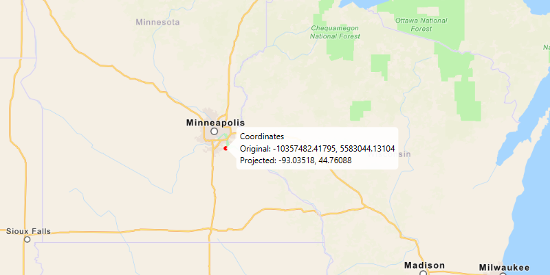

<h1>Project</h1>

Project a point to another spatial reference.

Being able to project between spatial references is fundamental to a GIS. An example of when you would need to 
re-project data is if you had data in two different spatial references, but wanted to perform an intersect analysis 
with the <code>GeometryEngine::intersect</code> function. This function takes two geometries as parameters, and both 
geometries must be in the same spatial reference. If they are not, you could first use 
<code>GeometryEngine::project</code> to convert the geometries so they match.

<h2>How to use the sample</h2>

Click anywhere on the map. A callout will display the clicked location's coordinate in the original (basemap's) 
spatial reference and in the projected spatial reference.

<h2>How it works</h2>

To project a geometry to another spatial reference:

<ol>
<li>Call the static method, <code>GeometryEngine.project</code>, passing in the original <code>Geometry</code> and a 
<code>SpatialReference</code> to project to.</li>
</ol>

<h2>Relevant API</h2>
<ul>
<li>GeometryEngine</li>
<li>Point</li>
<li>SpatialReference</li>
</ul>
