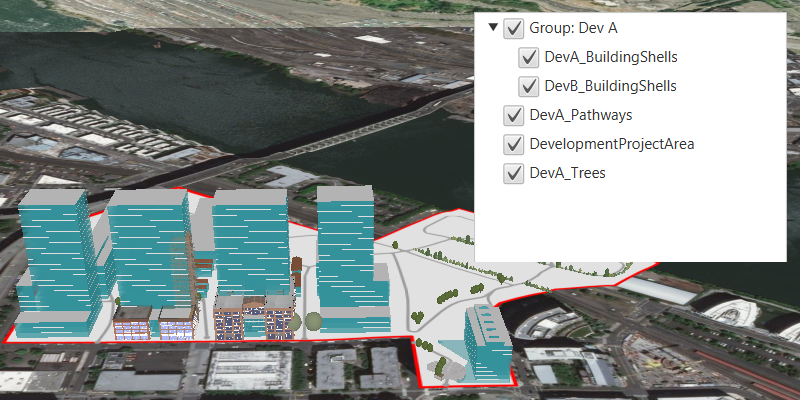

# Group layers

Group a collection of layers together and toggle their visibility as a group.

## Use case

Group layers communicate to the user that layers are related and can be managed together.

In a land development project, you might group layers according to the phase of development.

## How to use the sample

The layers in the map will be displayed in a table of contents. Toggle the checkbox next to a layer's name to change its visibility.

## How it works

1.  Create an empty `GroupLayer`.

2.  Add a child layer to the group layer's layers collection.

3.  To toggle the visibility of the group, simply change the group layer's visibility property.

## Relevant API

*   GroupLayer

## Additional information

The full extent of a group layer may change when child layers are added/removed. Group layers do not have a spatial reference, but the full extent will have the spatial reference of the first child layer.

Group layers can be saved to web scenes. In web maps, group layers will be flattened in the web map's operational layers.

The implementation shown here makes use of a custom tree cell for displaying layers in a tree view. In the custom 
tree cell, toggling the checkbox of the group layer cell does not also toggle the child cell's checkbox. If you 
desire this behavior, use or extend JavaFX's `CheckBoxTreeCell` and `CheckBoxTreeItem`.

<h2 id="tags">Tags</h2>

Layers, group layer