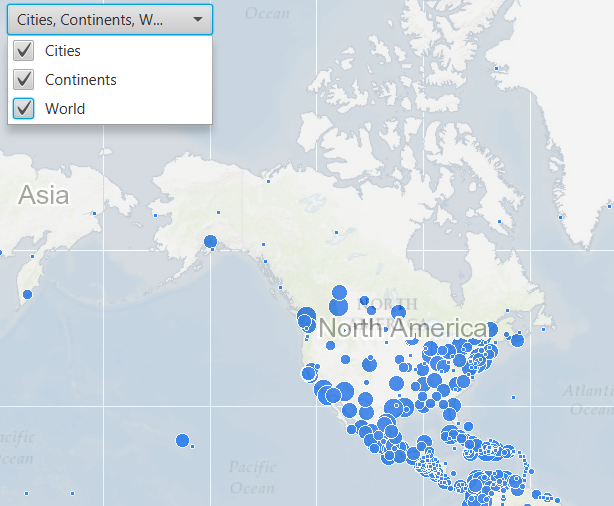

#Map Image Layer Sublayer Visibility#
This sample demonstrates how to add multiple layers to your `ArcGISMap` using a `BasemapType` and an `ArcGISMapImageLayer` which as multiple sub-layers.

##How to use the sample##
The sample provides a drop down on the top which displays the list of `ArcGISSubLayers`. Each sublayer in the list has a check-box, which can be used to toggle the visibility of that particular sublayer.

##How it works##
To add an ArcGISMapImageLayer to your ArcGISMap using its URL:

- Create an ArcGISMapImageLayer from its URL.
- Add it to `ArcGISMap#getOperationalLayers()`.
- Display the ArcGISMap by adding it to the `MapView`.
- Gain access to the sub-layers from the `ArcGISMapImageLayer#getSubLayers()` method which returns a SubLayerList. The SubLayerList is a modifiable list of `ArcGISSubLayers`. 
- Determine if the layer is visible or not by turning on / off the ArcGISSubLayers visibility in the SubLayerList.

##Features##
- ArcGISMap
- ArcGISMapImageLayer
- SubLayerList
