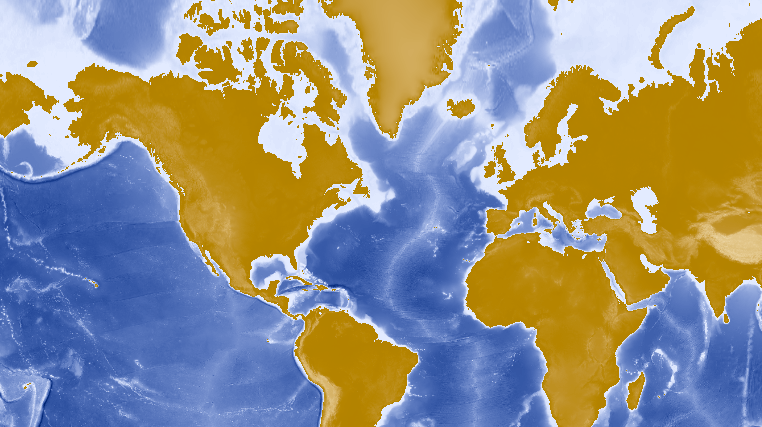

#Map Image Layer#
Demonstrates how to display an ArcGISMapImageLayer on a ArcGISMap. Typically this type of content is known as operational data, an example would be business data that changes frequently, such as displaying a fleet of vehicles as they make deliveries.

##How it works##
To add an `ArcGISMapImageLayer` to your `ArcGISMap` using its URL:

- Create an ArcGISMap image layer from its URL.
- Add it to `ArcGISMap.getOperationalLayers().add()`.
- Display the ArcGISMap by adding it to the `MapView`.

##Features##
- ArcGISMapImageLayer
- ArcGISMap
- MapView
