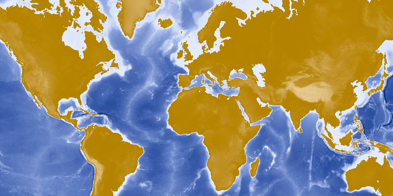

#Map Image Layer#
This sample demonstrates how to display an `ArcGISMapImageLayer` on a `ArcGISMap`. Typically
this type of content is known as operational data, example being business data that changes frequently, such as displaying a fleet of vehicles as they make deliveries.

##How it works##
To add an ArcGISMapImageLayer to your ArcGISMap using its URL:

- Create an ArcGISMapImageLayer from its URL.
- Add it to `ArcGISMap#getOperationalLayers()`.
- Display the ArcGISMap by adding it to the `MapView`.

##Features##
- MapView
- ArcGISMapImageLayer
- ArcGISMap