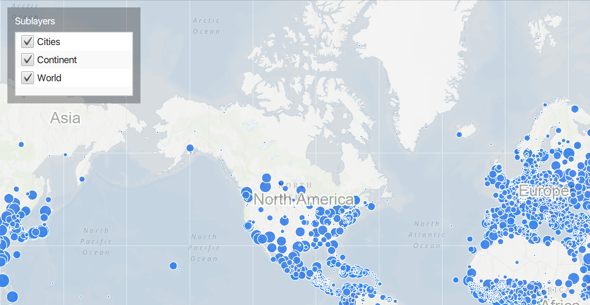

# Map Image Layer Sublayer Visibility

Change the visibility of sublayers.

## How to use the sample

Each sublayer has a check-box which can be used to toggle the visibility of the sublayer.

## How it works

To change visibility of a `ArcGISSubLayer` from your `ArcGISMap`:

  1. Create an `ArcGISMapImageLayer` from its URL.
  2. Add it to `ArcGISMap.getOperationalLayers().add()`.
  3. Display the ArcGISMap by adding it to the `MapView`.
  4. Gain access to the sub-layers from the `ArcGISMapImageLayer.getSubLayers()` method which returns a `SubLayerList`. The sub layer list is a modifiable list of ArcGISSubLayers.
  5. Determine if the layer is visible or not by turning on / off the ArcGIS sub layers visibility in the sub layer list.

## Relevant API

  * ArcGISMap
  * ArcGISMapImageLayer
  * Basemap
  * MapView
  * SubLayerList

