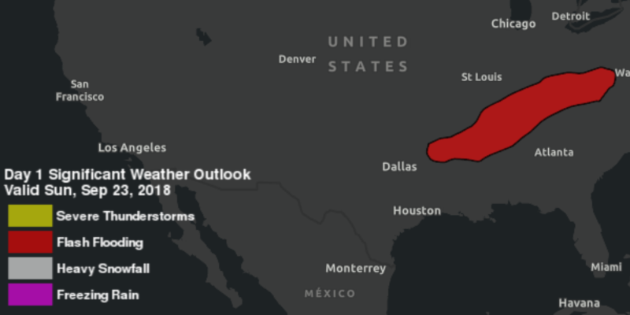

# Display KML

Display a KML layer from a URL, portal item, or local KML file.

## How it works

To display a `KMLLayer`:

1. To create a KML layer from a URL, create a `KMLDataset` using the URL to the KML file. Then pass the dataset to the `KmlLayer` constructor.
2. To create a KML layer from a portal item, construct a `PortalItem` with a portal and the KML portal item. Pass the portal item to the `KmlLayer` constructor.
3. To create a KML layer from a local file, create a `KMLDataset` using the absolute file path to the local KML file. Then pass the dataset to the `KmlLayer` constructor.
4. Add the layer as an operational layer to the map with `map.getOperationalLayers().add(kmlLayer)`.

## Relevant API

* KmlDataset
* KmlLayer
* Portal
* PortalItem
