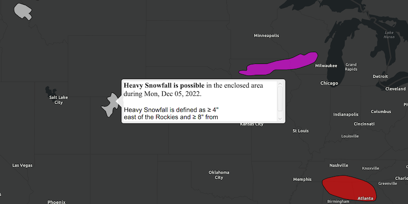

# Identify KML Features

Get clicked features in a KML Layer.

## How to use the sample

When the KML layer is done loaded, click on one of the features. A callout should display next to the feature with HTML describing it.

## How it works

To identify KML features:

  1. Add a `KmlLayer` to the map as an operational layer.
  2. Add a clicked listener to the map view with `mapView.setOnMouseClicked` to get the clicked screen point.
  3. Identify features at the screen location with `mapView.identifyLayerAsync(kmlLayer, screenPoint, tolerance, false)`.
  4. Use the returned future to get the `IdentifyLayerResult`.
  5. Loop through `result.getElements()`, looking for `GeoElements` which are instances of `KmlPlacemark`.

## Relevant API

*   IdentifyLayerResult
*   KmlDataset
*   KmlLayer
*   KmlPlacemark

