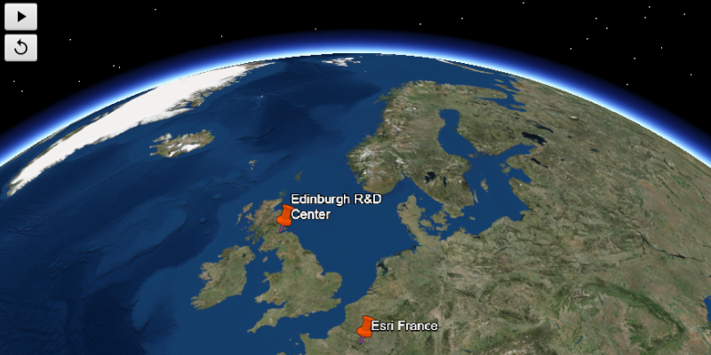

# Play KML Tour

Play tours in KML files.

## Use case

KML, the file format used by Google Earth, supports creating tours, which can control the viewpoint of the scene, hide and show content, and play audio. Tours allow you to easily share tours of geographic locations, which can be augmented with rich multimedia. Runtime allows you to consume these tours using a simple API.

## How to use the sample

The sample will load the KMZ file from ArcGIS Online. Click the play button to start the tour. The narration audio will start and then the viewpoint will animate. Press the button again to pause the tour. To restart the tour, hit the refresh button and then the play button.

## How it works

1. Create a `KmlDataset` with the path to a local KML file with a KML tour.
2. Create and load a `KmlLayer` with the dataset.
3. When the layer has loaded, search its `KmlNode`s by recursing through `kmlLayer.getRootNodes()` to find a `KmlTour` node.
4. Create a `KmlTourController` and set the tour with `kmlTourController.setTour(kmlTour)`.
5. Use `kmltourController.play()`, `kmltourController.pause()`, and `kmltourController.reset()` to control the tour.

## Relevant API

* KmlTour
* KmlTourController

## About the data

This sample uses a custom tour created by a member of the ArcGIS Runtime SDK samples team. When you play the tour, you'll see a narrated journey through some of Esri's offices.

## Additional information

See [Touring in KML](https://developers.google.com/kml/documentation/touring) in *Keyhole Markup Language* for more information.

## Tags

animation, interactive, KML, narration, pause, play, story, tour
