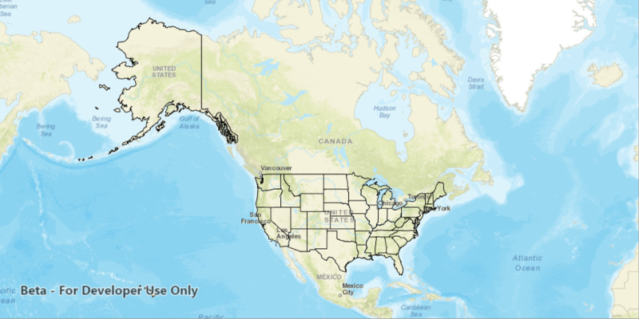

#Local Server Feature Layer
Demonstrates how to start a Local Server and Local Feature Service, then create a Feature Layer from the Local Feature Service and add it to a map. 

##How to use the sample
A Local Server and Local Feature Service will automatically be started and once running a Feature Layer will be created and added to the map. 
  

  

##How it works
To create a `FeatureLayer` from a `LocalFeatureService`:

1. Create and run a local server.
  - `LocalServer.INSTANCE` creates a local server
  - `Server.startAsync()` starts the server asynchronously
2. Wait for server to be in the  `LocalServerStatus.STARTED` state.
  - `Server.addStatusChangedKistener()` fires whenever the running status of the local server has changed.
3. Create and run a local feature service.
  - `new LocalFeatureService(Url)`, creates a local feature service with the given url path to mpk file
  - `LocalFeatureService.startAsync()`, starts the service asynchronously
  - service will be added to the local server automatically
4. Wait for feature service to be in the  `LocalServerStatus.STARTED` state.
  - `LocalFeatureService.addStatusChangedKistener()` fires whenever the running status of the local service has changed.
5. Create feature layer from local feature service.
  - create a `ServiceFeatureTable(Url)` from local feature service url, `LocalFeatureService.getUrl()`
  - create feature layer from service feature table, `new FeatureLayer(ServiceFeatureTable)`
6. Add feature layer to map, `Map.getOperationalLayers().add(featureLayer)`.

##Tags
- LocalFeatureService
- LocalServer
- LocalServerStatus
- StatusChangedEvent
