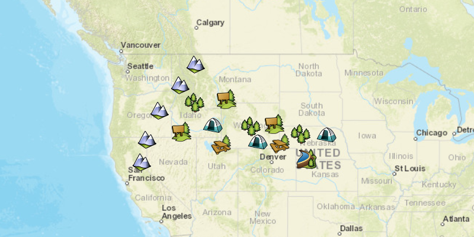

# Local Server feature layer

Start a local feature service and display its features in a map.

## Use case

For executing offline geoprocessing tasks in your ArcGIS Runtime apps via an offline (local) server.

## How to use the sample

A Local Server and Local Feature Service will automatically be started. Once started then a `FeatureLayer` will be created and added to the map.

## How it works

1. Create and run a local server with `LocalServer.INSTANCE`.
2. Start the server asynchronously with `Server.startAsync()`.
3. Wait for server to be in the  `LocalServerStatus.STARTED` state.
   * Callbacks attached to `Server.addStatusChangedListener()` will invoke whenever the status of the local server has changed.
4. Create and run a local feature service.
   1. Instantiate `LocalFeatureService(Url)` to create  a local feature service with the given url path to mpk file.
   2. Start the service asynchronously with `LocalFeatureService.startAsync()`.
      * The service will be added to the local server automatically.
5. Wait for state of the feature service to be `LocalServerStatus.STARTED`.
   * Callbacks attached to `LocalFeatureService.addStatusChangedListener()` will invoke whenever the status of the local service has changed.
6. Create a feature layer from local feature service.
   1. Create a `ServiceFeatureTable(Url)` from local feature service url provided by `LocalFeatureService.getUrl()`.
   2. Load the table asynchronously using `ServiceFeatureTable.loadAsync()`.
   3. Create feature layer from service feature table using `new FeatureLayer(ServiceFeatureTable)`.
   4. Load the layer asynchronously using `FeatureLayer.loadAsync()`.
7. Add feature layer to map using `ArcGISMap.getOperationalLayers().add(FeatureLayer)`.

## Relevant API

* FeatureLayer
* LocalFeatureService
* LocalServer
* LocalServerStatus
* StatusChangedEvent

## Additional information

Local Server can be downloaded for Windows and Linux platforms. Local Server is not supported on macOS.

## Tags

feature service, local, offline, server, service
